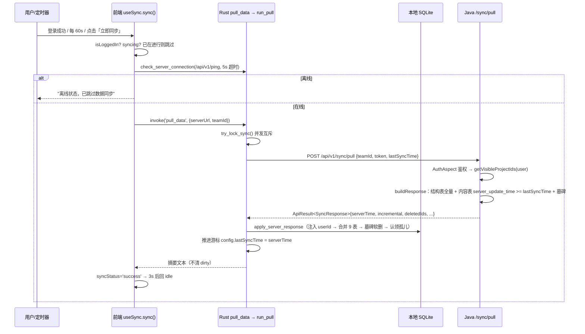
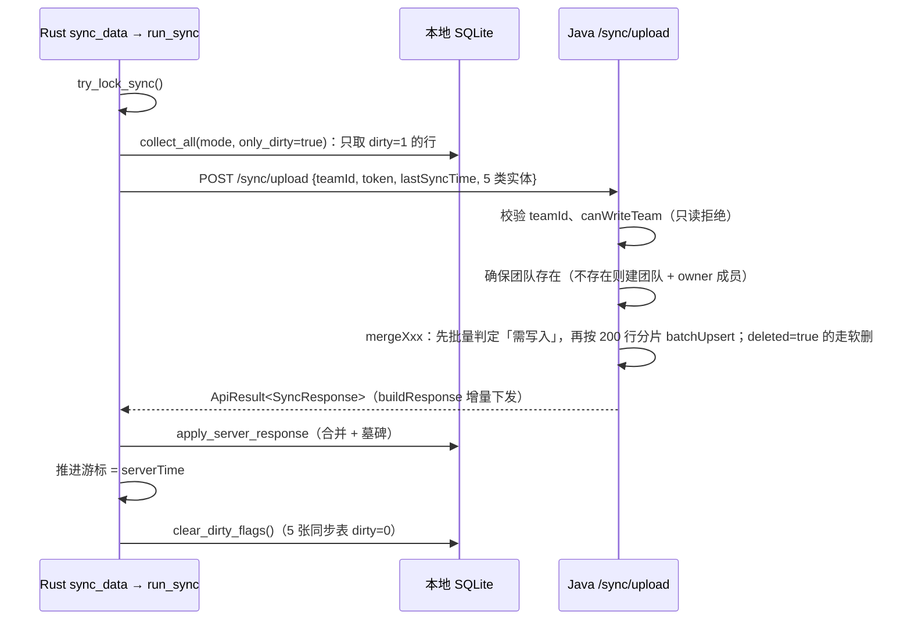

# 沧海 API 调试工具 — 数据同步逻辑设计文档

> 适用范围：`client/apps/web`（Vue3 前端）、`client/apps/desktop`（Tauri + Rust 本地层）、`client-server`（Spring Boot 服务端）
> 文档基于当前代码实现整理，描述「三端如何协同完成数据同步」。相关阶段记录见 [ARCHITECTURE_OPTIMIZATION.md](./ARCHITECTURE_OPTIMIZATION.md) Phase 4。

---

## 1. 总体结论（先看这里）

1. **同步的主链路是「只拉不推」（pull-only）**：前端 `useSync.sync()` 只调用 Rust 的 `pull_data` 命令，把服务端数据合并进本地 SQLite 缓存；**前端当前不会调用 `sync_data`（上传通道）**，该通道在 Rust/Java 两侧仍完整保留、可用。
2. **在线模式的增删改不走同步**：分类 / 接口 / 环境等写操作由前端直连后端 HTTP 接口（经 Rust `call_server_api` 代理转发）实时落库到 MySQL，再把结果写回本地 SQLite 作为缓存。同步只负责「把服务端最新状态刷到本地」。
3. **增量同步采用「服务端时间游标 + 版本号」**：
   - 下发（pull）：服务端按 `server_update_time >= lastSyncTime` 过滤，只回传变更行，并用 `deletedIds` 下发墓碑；
   - 上传（upload）：客户端按 `dirty = 1` 只上报脏行（该能力当前备用）。
4. **冲突判定三端一致**：先比 `update_time`，同一秒再比 `sync_version`；否则会出现「本地永远赢」的静默覆盖。
5. **游标与 `server_update_time` 必须同源**：连接串把 MySQL 会话时区钉在 `Asia/Shanghai`，游标取数据库的 `NOW(3)`；两者一旦偏离一个时区，增量条件就会恒不成立（增量恒为空）或恒成立（每次全量）。

---

## 2. 参与方与职责

| 层 | 位置 | 职责 |
|---|---|---|
| 前端（Vue3） | `client/apps/web/src` | 触发同步时机（登录后 / 定时 / 手动）、展示同步状态、在线模式直连后端写入、编辑冲突检测 |
| 本地层（Rust/Tauri） | `client/apps/desktop/src` | 同步编排（收集/上传/合并/推进游标）、本地 SQLite 读写、JWT 验签、后端 HTTP 代理（避免 WebView 跨域） |
| 服务端（Spring Boot） | `../client-spring-boot-server/src/main/java` | 权威数据源、权限校验、冲突合并（upsert）、增量过滤、墓碑下发、游标生成 |
| 存储 | MySQL `canghai_api` / 本地 SQLite | 服务端主库 / 客户端缓存与离线库 |

关键文件索引见第 14 节。

---

## 3. 数据模型与字段语义

### 3.1 两类数据

| 类别 | 实体 | 同步策略 |
|---|---|---|
| **结构数据** | `Project`、`Team`、`TeamMember`、`ProjectMember` | 数据量小、变更少，**每次同步全量下发**，无版本列 |
| **内容数据**（5 张同步表） | `Category`、`SavedRequest`、`EnvironmentGroup`、`Environment`、`EnvironmentVariable` | **增量下发 + 脏标记上传 + 墓碑删除**，带 `server_update_time` / `sync_version` / `dirty` |

Rust 侧常量：`db/sync.rs::SYNC_TABLES = [ch_categories, ch_saved_requests, ch_environments, ch_environment_groups, ch_environment_variables]`。

### 3.2 同步相关的关键列

| 字段（DB 列名） | JSON 名 | 所在端 | 语义 |
|---|---|---|---|
| `update_time` | `updateTime` | 三端 | 业务层修改时间（秒级），冲突判定第一优先级 |
| `server_update_time` | `serverUpdateTime` | MySQL 列 / SQLite 列 | **服务端行变更时间（毫秒精度）**，MySQL 自动维护；增量游标过滤字段；客户端也存一份用于「编辑冲突检测」 |
| `sync_version` | `syncVersion` | MySQL / SQLite | 服务端行版本号，MySQL `BEFORE UPDATE` 触发器自增；同秒并发时 tie-break |
| `dirty` | — | 仅 SQLite | 本地未上传标记（1=待上传）；`collect_all(only_dirty=true)` 依据 |
| `deleted` | `deleted` | 三端 | 软删除标记（服务端软删 + 客户端软删） |
| `data_mode` | — | 仅 SQLite | `online` / `offline` 数据隔离维度，同步只处理 `online` |
| `lastSyncTime` | `lastSyncTime` | 配置 / 请求体 | 客户端持久化的增量游标（**服务端时间字符串**） |

> **命名坑**：服务端版本号叫 `sync_version` 而非 `version`，因为 `ch_saved_requests.version` 已被本地「请求快照版本」占用，语义不同。

### 3.3 服务端 DDL（`db/migration/V2__sync_incremental.sql`）

- 为 5 张内容表新增：
  - `server_update_time DATETIME(3) NOT NULL DEFAULT CURRENT_TIMESTAMP(3) ON UPDATE CURRENT_TIMESTAMP(3)`（**MySQL 自动维护，业务 CRUD 与同步合并零代码覆盖**）
  - `sync_version INT NOT NULL DEFAULT 1`
  - 索引 `idx_*_sut (server_update_time)`
- 存量数据按 `update_time` 回填 `server_update_time`。
- 创建 5 个触发器 `trg_ch_*_bu`：`NEW.sync_version = OLD.sync_version + 1`（回填后再建，避免存量行被平白 +1）。

### 3.4 客户端 SQLite 迁移（`db/schema.rs`）

- 为 5 张同步表补列：`server_update_time TEXT DEFAULT ''`、`sync_version INTEGER DEFAULT 1`、`dirty INTEGER DEFAULT 1`（用 `migrate_add_column` 幂等增量迁移）。
- **存量行 `dirty` 默认 1** → 首次上传仍是全量，之后才是纯增量。

---

## 4. 同步 API 契约

### 4.1 端点

| 端点 | 方法 | 调用方 | 服务端处理 | 是否需要写权限 |
|---|---|---|---|---|
| `/api/v1/sync/upload` | POST | Rust `sync::run_sync`（前端当前未调用） | `SyncService.upload` → 合并 + 下发 | 需要（`canWriteTeam`，只读成员返回 403/40103） |
| `/api/v1/sync/pull` | POST | Rust `sync::run_pull`（**前端主路径**） | `SyncService.pull` → 仅下发 | 不需要（只读成员可拉取） |
| `/api/v1/ping` | GET | `check_server_connection` | 连通性探测（200） | 否（白名单） |
| `/api/v1/auth/login` `/register` `/me` | POST | 登录/注册/校验 | 签发 JWT / 返回当前用户 | 否 |
| `/api/v1/category/*`、`/request/*`、`/environment/*` | POST | 前端在线模式直连（经 `call_server_api`） | 业务 CRUD 落库 | 按接口 |

### 4.2 请求体（`SyncData`）

Rust 侧 `sync.rs::SyncData`：

```jsonc
{
  "teamId": "xxx",
  "token": "<jwt>",            // 由调用方填入（Java 侧 SyncData 无此字段，由 AuthAspect 从原始 body 读取）
  "categories": [...],
  "requests": [...],
  "environmentGroups": [...],
  "environments": [...],
  "environmentVariables": [...],
  "lastSyncAt": null,
  "lastSyncTime": "2026-09-17 06:12:33.123"  // 为空/缺省 => 全量
}
```

`pull` 的请求体更精简（`sync.rs::run_pull`）：

```json
{ "teamId": "xxx", "token": "<jwt>", "lastSyncTime": "..." }
```

> `pull` 走的是 `post_json_with_retry`，只带 `Content-Type`，**不带 `Authorization` 头**；服务端 `AuthAspect` 从 body 的 `token` 字段取凭证。
> `Project` / `Team` / `TeamMember` / `ProjectMember` **不参与上报**：项目经 `/api/v1/project/save` 实时落库，团队/成员仅由服务端权威下发。

### 4.3 响应体（`SyncResponse`）

```jsonc
{
  "teamId": "xxx",
  "syncAt": 1758000000000,
  "serverTime": "2026-09-17 06:12:33.123",  // 下次要回传的游标
  "incremental": true,                       // 本次是否增量下发
  "deletedIds": ["id1", "id2"],              // 墓碑（仅 incremental=true 时非空）
  "projects": [...], "projectMembers": [...], "teams": [...], "teamMembers": [...],  // 永远全量
  "categories": [...], "requests": [...], "environmentGroups": [...],
  "environments": [...], "environmentVariables": [...]                              // 增量或全量
}
```

### 4.4 统一响应信封

三端一致：`{ success: boolean, code: int, msg: string, data: T }`，`code == 0` 表示成功。
错误码定义以 Java `ErrorCode` 为权威，Rust 侧 `sync.rs::codes` 为同义常量（与 [API_CONTRACT.md](./API_CONTRACT.md) §3 对齐）：

| code | 含义 |
|---|---|
| 0 | 成功 |
| 40000 / 40001 | 参数无效 / 缺少必填参数 |
| 40100 / 40103 | 未登录或 token 无效 / 无权限 |
| 40400 / 40900 / 42200 | 不存在 / 冲突 / 业务失败 |
| 50000 / 50001 / 50002 | 服务端内部错误 / 本地 DB 错误 / 下游（网络）错误 |

---

## 5. 核心流程

### 5.1 拉取同步（pull-only，前端当前主路径）



要点：

- 前端 `useSync.sync()`（`composables/useSync.ts:360`）内部顺序为：登录校验 → 内存态 `syncing` 去重 → 连通性探测 → `repo.pullData()`。
- `pull_data` 命令（`commands/sync.rs:276`）要求已登录（`auth_token` 非空，否则 40100「请先登录后再同步」），并把本次 `serverUrl` / `teamId` 回写配置，确保后续 `call_server_api` 指向同一后端实例。
- `run_pull`（`sync.rs:577`）与 `run_sync` 复用**同一把并发锁** `SYNC_RUNNING`，两者不会交叉执行。
- 拉取成功后**不清 `dirty`**（因为本地变更并未上传）。

### 5.2 上传同步（`sync_data`，通道保留、前端暂未使用）



要点的差异：上传成功后调用 `db::clear_dirty_flags(conn, mode)`（`db/sync.rs:206`），把 5 张表的 `dirty` 全部置 0，使下一次上传退化为空集 → 真正增量。

### 5.3 应用启动 / 定时同步时机（前端）

| 时机 | 位置 | 行为 |
|---|---|---|
| 应用启动 | `App.vue` `onMounted` → `initAuth()` | 从 Tauri `sync_config`（权威源）恢复 token/teamId；`/api/v1/auth/me` 校验用户；仅鉴权类错误才清登录态 |
| 布局挂载 | `layouts/AppLayout.vue:460` | `loadSyncConfig()` + `startAutoSync(60000)` |
| 登录/注册成功 | `useSync.ts::triggerSyncAfterLogin` | 立即同步一次，成功后再 `loadTeams()` / `loadCurrentTeamMembers()` |
| 定时 | `startAutoSync`（默认 60s） | 仅登录后执行；失败静默 |
| 手动 | `AppLayout.doSync()` | `sync({ serverUrl: settings.serverUrl, teamId: currentTeamId })` |
| 布局卸载 | `AppLayout.vue:470` | `stopAutoSync()` |

---

## 6. 合并与冲突判定

### 6.1 判定规则（三端必须一致）

```
比较 (update_time, sync_version)：
  update_time 大者胜
  若相等 → sync_version 大者胜
```

实现位置：

| 端 | 函数 | 方向 |
|---|---|---|
| Rust | `sync.rs::server_is_newer(server_ts, server_ver, local_ts, local_ver)` | 服务端是否更新（> 则覆盖本地） |
| Java | `SyncService.compareToServer(clientTime, clientVersion, serverStamp)` | *> 0* 表示客户端更新（覆盖服务端） |
| 前端 | `lib/serverApi.ts::isServerNewer(serverUpdateTime, localServerUpdateTime, serverSyncVersion, localSyncVersion)` | 服务端是否更新（用于编辑冲突弹窗） |

### 6.2 Rust 侧合并（下发 → 本地）

`sync.rs::merge_server_data`：

1. 整体包在 **单个 SAVEPOINT 事务** 内（`db::in_transaction`），避免逐行隐式提交；
2. 逐表执行 `merge_entities`，共 9 张表：结构表 4 张（`versioned=false`，纯时间戳比较）+ 内容表 5 张（`versioned=true`，带版本兜底）；
3. `merge_entities` 先一次性载入本地 `id → (update_time, sync_version)` 映射（`load_id_update_time_map`，避免逐行查询），然后：
   - 本地不存在 → `save_*_for_merge`（`INSERT OR REPLACE ... dirty=0`）；
   - 本地存在且服务端更新 → `update_*_for_merge`（`UPDATE ... dirty=0`）；
   - 否则保持本地不变。

`sync.rs::apply_server_response` 在合并前/后还做三件事：

- **注入 `user_id`**：服务端数据不带 userId（靠 `ch_project_members` 关联），合并前把当前登录用户 id 写入 `projects` / `requests`，使本地可按用户过滤（登出后查不到）；
- **墓碑删除**：`deletedIds` 非空时调用 `db::apply_deleted_ids`；
- **认领孤儿**：在线模式下把 `data_mode='online'` 且 `user_id` 为空的旧项目/接口归属到当前用户。

### 6.3 Java 侧合并（上传 → 服务端）

`SyncService.mergeByProjectIds` / `mergeGlobal`（Phase 7.3 改造后为「先收集、后批量」）：

1. 按 `visibleProjectIds` 过滤客户端数据（防越权写入不可见项目）；
2. 批量加载服务端 `(update_time, sync_version)` 戳（`loadServerStampMap`，只查 `deleted = 0` 的行）；
3. 只对「服务端不存在」或「`compareToServer > 0`（客户端更新）」的行收集为 `toUpsert`；
4. `batchUpsert` 按 **200 行分片** 执行（`ON DUPLICATE KEY UPDATE`，不覆盖 `create_time`）；
5. 客户端上报中 `deleted = true` 的行一律执行服务端软删（`softDelete`）。

`upload` 方法整体标注 `@Transactional(rollbackFor = Exception.class, timeout = 120)`，保证 5 类实体的 upsert/软删原子性。

> **注意（已知语义）**：`loadServerStampMap` 只查 `deleted = 0`，因此服务端已软删的行在戳映射中「不存在」。若客户端随后上报同一 id 且 `deleted = false`，会被判定为「服务端不存在」而重新 upsert（即复活）。这是当前实现的边界行为。

---

## 7. 增量游标机制

### 7.1 游标生成（服务端）

`SyncService.serverTimeNow()`：

```sql
SELECT DATE_FORMAT(NOW(3), '%Y-%m-%d %H:%i:%s.%f')   -- 取数据库时钟（会话时区 = Asia/Shanghai）
```

取前 23 个字符即 `yyyy-MM-dd HH:mm:ss.SSS`（与 `DATETIME(3)` 列读出的字符串同构，可直接参与列比较），通过 `SyncResponse.serverTime` 下发。

**为什么用 `NOW(3)` 而不是 `UTC_TIMESTAMP(3)`**：`server_update_time` 由 MySQL 的 `CURRENT_TIMESTAMP(3)` 按**会话时区**写入。游标只要与它出自同一个会话时钟，增量条件就一定自洽；改用 `UTC_TIMESTAMP(3)` 反而隐含「会话时区恰好是 UTC」这一前提。三端基准统一为北京时间后，连接串（`connectionTimeZone=Asia/Shanghai&forceConnectionTimeZoneToSession=true`）把会话时区钉死，因此 `NOW(3)` 更稳——即使时区配置被改错，游标与列值也会一起偏移，而不会互相错位。

**为什么以字符串而非 `Timestamp` 读**：`Timestamp` 会经过 JDBC 驱动的时区换算（受 `connectionTimeZone` 与 JVM 默认时区影响），`DATE_FORMAT` 返回的则是数据库字面值，天然免疫驱动换算。

取不到 DB 时钟时兜底用 `LocalDateTime.now(ZoneId.of("Asia/Shanghai"))`。

### 7.2 增量条件与「宁可重复不可漏」

- 服务端过滤条件：`server_update_time >= lastSyncTime`（用 `>=` 而非 `>`；`DATETIME(3)` 存在毫秒撞车，重复下发无害，因为客户端合并是按 id 幂等 upsert）。
- 判定增量：`incremental = !lastSyncTime.isEmpty()`。
- **游标超前保护**：若 `lastSyncTime > serverTime`（客户端升级前可能存过「本地时钟生成」的旧游标），则强制退化为全量，避免客户端永远拉不到变更。

### 7.3 游标推进与持久化

- Rust 侧在 `run_sync` / `run_pull` 成功后，把 `server_data.server_time` 写入内存 `SyncConfig.last_sync_time`；
- `commands/sync.rs` 在命令返回成功后调用 `save_config` 持久化到 `sync_config.json`；
- 下次请求把该值作为 `lastSyncTime` 回传。

### 7.4 客户端配置持久化（`infra.rs`）

配置文件：`{app_data_dir}/sync_config.json`，字段 `serverUrl / teamId / authToken / userId / lastSyncTime`。

约定：

- **token 优先写入系统钥匙串**（service=`canghai-api-doc`，account=`auth_token`），并**回读校验**；只有回读成功才把落盘 JSON 中的 `auth_token` 置空，否则回退明文落盘（保证可用）。
- **`set_sync_config` 为「读-合并-写」**：只有非空字段才覆盖（`lastSyncTime` 为 `Some` 时覆盖），避免前端只传部分字段时把 `userId` / `lastSyncTime` 抹掉。
- **`save_config` 把「空 token」视为「不改动」**（回填既有 token），因此**登出必须走 `clear_auth`**（先 `delete_token` 再落盘空 token）。

---

## 8. 墓碑删除（deletedIds）

- 服务端在**增量模式**下，对 5 张同步表查询 `deleted = 1 AND server_update_time >= lastSyncTime` 的 id 集合；环境变量需先按可见项目取出 `environmentId` 列表再查。
- 全量模式（`incremental=false`）`deletedIds` 为空（行为与改造前一致）。
- 客户端 `db/sync.rs::apply_deleted_ids`：对每个 id 逐表执行 `UPDATE {t} SET deleted = 1, dirty = 0 WHERE id = ? AND data_mode = ?`；id 为全局唯一 UUID，未命中则影响 0 行，因此逐表尝试是安全的。

> 墓碑是「增量感知删除」的必要补充：增量只回传「存在且被修改」的行，被删除的行不会出现在数据列表中。

---

## 9. 本地脏标记（dirty）

| 场景 | 动作 |
|---|---|
| 存量行迁移 | `dirty` 默认 1（首次上传全量） |
| 本地新建 / 修改 | `save_*` / `update_*` 写路径置 `dirty = 1`（如 `crud/categories.rs:53/68/93`） |
| 服务端数据合并写入 | `save_*_for_merge` / `update_*_for_merge` 显式 `dirty = 0` |
| 上传成功后 | `clear_dirty_flags` 对 5 张表整表 `dirty = 0`（限当前 `data_mode`） |
| 墓碑软删 | `deleted = 1, dirty = 0` |

收集侧：`get_all_categories` / `get_all_saved_requests` 等通过 `(?N = 0 OR dirty = 1)` 支持「全量 / 仅脏行」两种模式。

> **现状提醒**：前端为 pull-only，在线写操作走 `call_server_api` 并在本地 `cacheFromServer` 落缓存（该路径会置 `dirty = 1`），但 `sync_data` 未被调用，因此在线模式下 `dirty` 不会被清零。这是当前设计的预期副作用，不影响拉取链路。

---

## 10. 在线模式直连写入（与同步并行的旁路）

在线模式下，分类 / 接口 / 环境变量的增删改**不经过同步通道**，而是：

```
前端 useServerApi() → lib/server.ts::invokeApi(path, payload)
  → invoke('call_server_api', { path, payload, token })
  → Rust commands/sync.rs::call_server_api
       ├─ 校验 path：必须以 /api/v1/ 开头，禁止 // 、../ 、\ 、:
       ├─ token：优先前端传入，否则回退本地配置
       ├─ JWT 验签（RS256，公钥在 Rust）→ 取得 userId / teamId；失败直接拒绝
       ├─ 组装 body：注入 mode=online、token，并透传 x_user_id / x_team_id
       ├─ POST，携带 Authorization: Bearer <token>（双通道兼容）
       └─ 拆解后端 {success,code,msg,data} 后透传 data
  → Java 对应 Controller → 业务落库（MySQL 自动刷新 server_update_time / sync_version）
  → 前端 repo.cacheFromServer(...) 写回本地 SQLite（含 serverUpdateTime 快照）
```

**编辑冲突检测**：写前先取服务端最新数据，用 `isServerNewer(server.updateTime, local.serverUpdateTime, server.syncVersion, local.syncVersion)` 判定；若服务端更新则弹出对比框（`stores/conflict.ts`）让用户确认后再保存。使用点：`composables/useCategories.ts`、`useSavedRequests.ts`、`useEnvironments.ts`。

由于后端落库会由 MySQL 自动刷新 `server_update_time` / `sync_version`，**下一次 pull 增量就会把这些变更带回本地缓存**——这是「在线写入」与「同步」两条链路的衔接点。

---

## 11. 认证与权限

- **算法**：RS256 JWT。Java 端用私钥签发，Rust 端内置公钥验签（`jwt.rs::verify_token`），前端不参与验签。
- **Rust 验签结果**：`call_server_api` 中验签成功可拿到 `sub`（userId）/ `team_id`，随 body 的 `x_user_id` / `x_team_id` 传给 Java；验签失败直接拒绝，阻断伪造 token。非 JWT 形态的旧 token 走 Passthrough，交由 Java 校验。
- **服务端鉴权**：`AuthAspect` 统一拦截（从 body 的 token 字段读取），白名单路径必须带 `/api/v1` 前缀（`/api/v1/auth/**`、`/api/v1/ping`、swagger、actuator）。
- **可见范围**：`projectMemberService.getVisibleProjectIds(user)` 决定下发与写入范围；`teamService.canWrite(teamId, userId)` 决定能否上传（只读成员上传返回 40103）。
- **结构数据下发范围**：`collectTeamIds` 汇总「可见项目关联的团队」∪「当前用户所属团队」，据此下发 `teams` / `teamMembers`。

---

## 12. 可靠性设计

| 机制 | 实现 |
|---|---|
| 同步互斥 | Rust 原子标记 `SYNC_RUNNING` + `SyncGuard`（RAII 释放）；`run_sync` 与 `run_pull` 共用，抢占失败返回 40900「同步正在进行中」 |
| 网络重试 | `post_json_with_retry`：最多 3 次（首次 + 2 次重试），指数退避 300ms / 600ms；**仅对传输层错误重试**（业务错误已到达服务端，重试会造成重复写入） |
| 合并原子性 | 客户端：`db::in_transaction`（SAVEPOINT，可嵌套，失败自动回滚）；服务端：`@Transactional(timeout=120)` |
| 批量写入 | 服务端 `batchUpsert` 按 200 行分片，规避 `max_allowed_packet` |
| 幂等性 | 所有合并均为按 id 的 upsert；`>=` 游标导致的重复下发无副作用 |
| 连接复用 | Rust `OnceLock` 共享 `reqwest::Client`（连接池复用）；探测用 5s 超时的独立客户端 |
| SQLite 并发 | `DbConn = Mutex<Connection>` 单连接串行 + WAL；评估结论为**暂不引入 r2d2 连接池**（桌面单用户，收益不抵改动 60+ 处 `lock_db` 的风险） |

---

## 13. 已知约束与遗留项

1. **前端为 pull-only**：`sync_data`（上传）通道在前后端均可用，但前端未接入；在线模式依赖直连接口落库。
2. **`dirty` 在 pull-only 下不清零**（见第 9 节现状提醒）。
3. **服务端软删行的戳映射缺失**：`loadServerStampMap` 过滤 `deleted = 0`，客户端上报 `deleted = false` 时可能复活已删行（第 6.3 节）。
4. **时间基准**：三端统一为 Asia/Shanghai（业务时间 `YYYY-MM-DD HH:mm:ss` 秒级；游标 `yyyy-MM-dd HH:mm:ss.SSS`）。早期为 UTC，存量数据需执行一次 `../client-spring-boot-server/src/main/resources/db/repair/shift_times_to_cst.sql`。
5. **本地历史**：`ch_history` 只存在于本地、不参与服务端同步，因此平移脚本覆盖不到它，旧记录会保留 8 小时偏差（上限 20 条，属可接受的展示噪音）。
6. **结构表无版本列**：项目/团队/成员冲突判定退化为纯 `update_time` 比较。
7. **迁移脚本序列为 V1 / V2 / V4 / V5**（无 V3），属历史编号，不影响 Flyway 执行。
8. **`EnvironmentVariable` 未按项目过滤版本戳**：`mergeGlobal` 按 id 加载（因变量无 `project_id` 列），依赖 `environment_id` 归属校验。

---

## 14. 关键文件索引

### 前端（`client/apps/web/src`）

| 文件 | 说明 |
|---|---|
| `composables/useSync.ts` | 同步编排入口：`sync()`（pull-only）、`startAutoSync/stopAutoSync`、`login/register/logout`、`initAuth` |
| `repositories/syncRepo.ts` | Tauri 命令收敛（`get_sync_config` / `set_sync_config` / `login` / `register` / `logout` / `check_server_connection` / `pull_data` / `fetchMe`） |
| `lib/server.ts` | `invokeApi()` 在线模式传输层（经 `call_server_api` 代理） |
| `lib/serverApi.ts` | 在线 CRUD 端点封装 + `isServerNewer()` 冲突判定 |
| `stores/session.ts` | `syncStatus` / `syncMessage` / `syncOnline` / `authToken` / `syncServerUrl` / `isLoggedIn` |
| `stores/conflict.ts` | 编辑冲突对比弹窗状态 |
| `repositories/{category,request,environment}Repo.ts` | `cacheFromServer`（写 `serverUpdateTime` 快照） |
| `layouts/AppLayout.vue` | 同步按钮 / 弹窗 / 启动定时同步 |

### Rust（`client/apps/desktop/src`）

| 文件 | 说明 |
|---|---|
| `sync.rs` | 同步核心：`SyncData`/`SyncResponse`/`ApiResult`/`codes`、`collect_all`、`merge_server_data`/`merge_entities`/`server_is_newer`、`apply_server_response`、`SyncGuard`、`post_json_with_retry`、`run_sync`、`run_pull` |
| `db/sync.rs` | `SYNC_TABLES`、`save_*_for_merge`/`update_*_for_merge`、`clear_dirty_flags`、`apply_deleted_ids`、`in_transaction` |
| `commands/sync.rs` | Tauri 命令：`get/set_sync_config`、`login`、`register`、`logout`、`sync_data`、`pull_data`、`check_server_connection`、`get_server_base_url`、`call_server_api` |
| `db/schema.rs` | SQLite 建表 + 增量迁移（`server_update_time` / `sync_version` / `dirty`） |
| `db/models.rs` | 实体定义（含 `server_update_time` / `sync_version`） |
| `db/crud/*.rs` | 本地读写（写路径置 `dirty=1`） |
| `infra.rs` | 配置持久化、钥匙串、共享 HTTP 客户端、`post_api_result`/`get_api_result` |
| `jwt.rs` | RS256 公钥验签 |

### Java（`../client-spring-boot-server/src/main/java`）

| 文件 | 说明 |
|---|---|
| `controller/SyncController.java` | `/api/v1/sync/upload`、`/api/v1/sync/pull` |
| `service/SyncService.java` | `upload` / `pull` / `buildResponse` / `serverTimeNow` / `compareToServer` / `mergeByProjectIds` / `mergeGlobal` / `batchUpsert*` / `loadDeletedIds` |
| `model/SyncData.java` / `model/SyncResponse.java` | 同步请求 / 响应契约 |
| `entity/{Category,SavedRequest,EnvironmentGroup,Environment,EnvironmentVariable}.java` | 含 `serverUpdateTime` / `syncVersion` |
| `mapper/*Mapper.java` | `batchUpsert`（`ON DUPLICATE KEY UPDATE`） |
| `resources/db/migration/V2__sync_incremental.sql` | 游标列 + 版本列 + 索引 + 回填 + 触发器 |

### 相关文档

- [ARCHITECTURE_OPTIMIZATION.md](./ARCHITECTURE_OPTIMIZATION.md)（Phase 4 增量同步落地记录，含验证结论）
- [ARCHITECTURE_REVIEW_AND_ROADMAP.md](./ARCHITECTURE_REVIEW_AND_ROADMAP.md)（§5.2 增量同步建议时序）
- [API_CONTRACT.md](./API_CONTRACT.md)（§3 错误码对齐）
